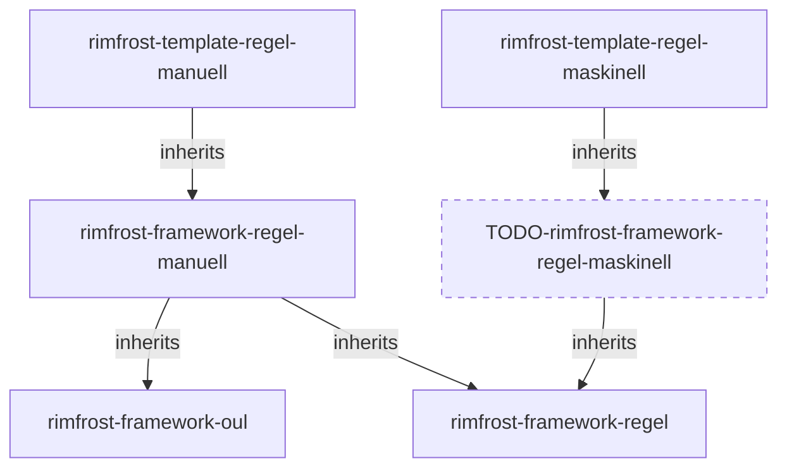

## Repositories

### rimfrost-framework-regel

Komponenter gemensamma för alla typer av regler (både maskinella och manuella).

- Inläsning av regel-konfiguration
- Kafka-interface request/response för regel initiering/avslut
- Rest-interface för Kundbehovsflöde get/update

### rimfrost-framework-oul

Hantering av reglers kommunikation med Operativt uppgiftslager

- Kafka-interface request/response för operativa uppgifter 
- Rest-interface hanterar Done-operation för operativa uppgifter

### rimfrost-framework-regel-maskinell

Komponenter gemensamma för alla maskinella regler

### rimfrost-framework-regel-manuell

Komponenter gemensamma för alla manuella regler

- Hantering av initiering av ny regel
- Hantering av Operativt uppfiftslager response
- Hantering av Operativt uppgiftslager status

### rimfrost-template-regel-maskinell

Template för implementation av maskinella regler.

- Template för implementation av handleRegelRequest

### rimfrost-template-regel-manuell

Template för implementation av manuella regler.

- Implementation av handleRegelrequest för alla manuella regler

