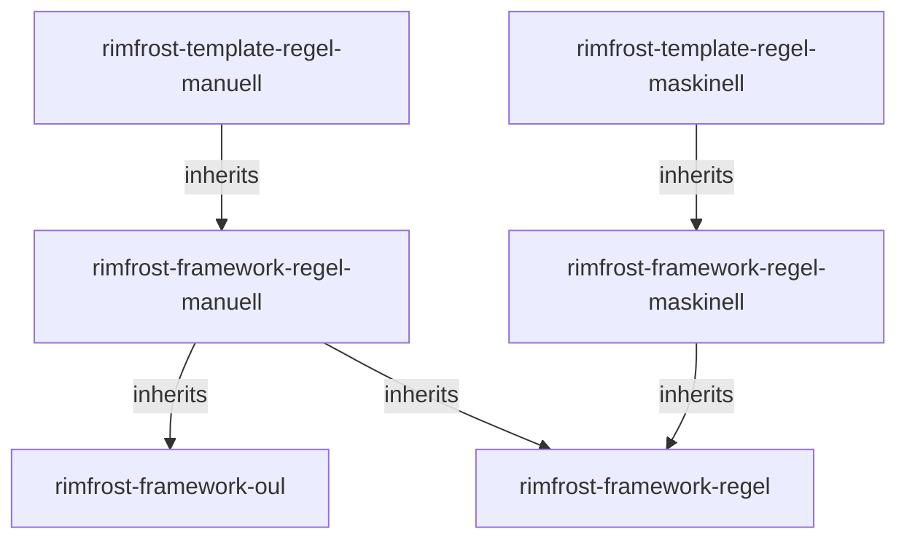
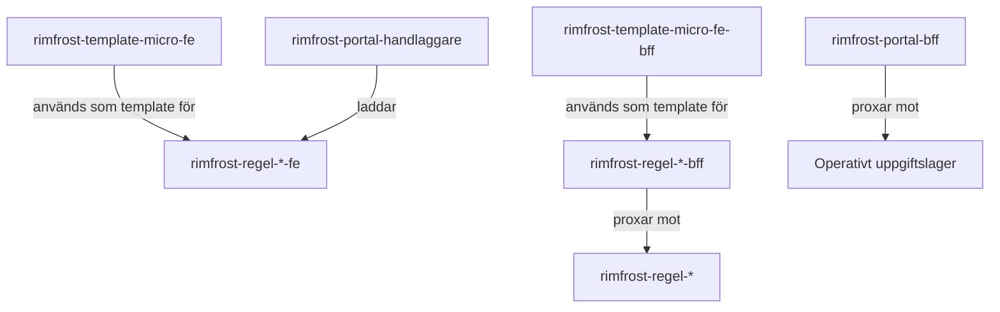

```mermaid
graph TD

    rimfrost-template-regel-manuell -->|inherits| rimfrost-framework-regel-manuell

    rimfrost-template-regel-maskinell -->|inherits| rimfrost-framework-regel-maskinell
    rimfrost-framework-regel-maskinell -->|inherits| rimfrost-framework-regel

    rimfrost-framework-regel-manuell -->|inherits| rimfrost-framework-oul
    rimfrost-framework-regel-manuell -->|inherits| rimfrost-framework-regel

    
```

## Repositories

### rimfrost-framework-regel

Komponenter gemensamma för alla typer av regler (både maskinella och manuella).

- Inläsning av regel-konfiguration
- Kafka-interface request/response för regel initiering/avslut
- Rest-interface för hantering av Yrkande och Handläggning

### rimfrost-framework-oul

Hantering av reglers kommunikation med Operativt uppgiftslager

- Kafka-interface request/response för operativa uppgifter 
- Rest-interface hanterar Done-operation för operativa uppgifter

### rimfrost-framework-regel-maskinell

Komponenter gemensamma för alla maskinella regler

### rimfrost-framework-regel-manuell

Komponenter gemensamma för alla manuella regler

- Hantering av initiering av ny regel
- Hantering av Operativt uppfiftslager response
- Hantering av Operativt uppgiftslager status

### rimfrost-template-regel-maskinell

Template för implementation av maskinella regler.

- Template för implementation av handleRegelRequest

### rimfrost-template-regel-manuell

Template för implementation av manuella regler.

- Implementation av handleRegelrequest för alla manuella regler

---

## Portal och micro-frontends

```mermaid
graph TD

    rimfrost-template-micro-fe -->|används som template för| regel-fe["rimfrost-regel-*-fe"]
    rimfrost-template-micro-fe-bff -->|används som template för| regel-bff["rimfrost-regel-*-bff"]

    rimfrost-portal-handlaggare -->|laddar| regel-fe
    rimfrost-portal-bff -->|proxar mot| OUL["Operativt uppgiftslager"]
    regel-bff -->|proxar mot| regel-backend["rimfrost-regel-*"]

```

### rimfrost-portal-handlaggare

Vue-baserad portalapplikation för handläggare. Listar tilldelade uppgifter och laddar rätt micro-frontend per uppgiftstyp baserat på uppgiftens `url`-fält från Operativt uppgiftslager.

### rimfrost-portal-bff

BFF (Backend For Frontend) för portalen. Proxar anrop mot Operativt uppgiftslager och hanterar hämtning och tilldelning av operativa uppgifter.

### rimfrost-template-micro-fe

Template för micro-frontend-implementation av manuella regler. Varje regel skapar ett eget repo baserat på denna template och implementerar en Vue-komponent som renderas inuti portalen.

### rimfrost-template-micro-fe-bff

Template för BFF till micro-frontends. Proxar anrop från micro-frontendens Vue-komponent mot regelns backend-service och hanterar eventuell datatransformation.

