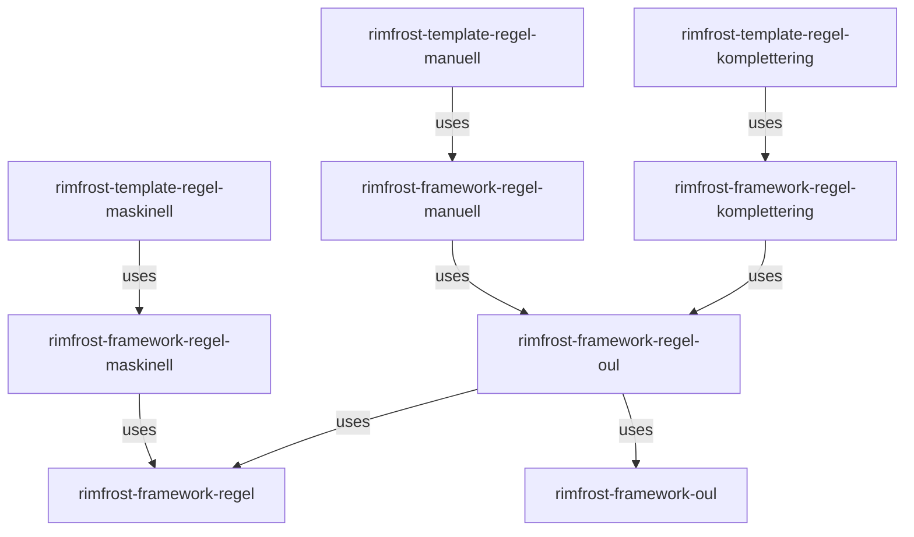
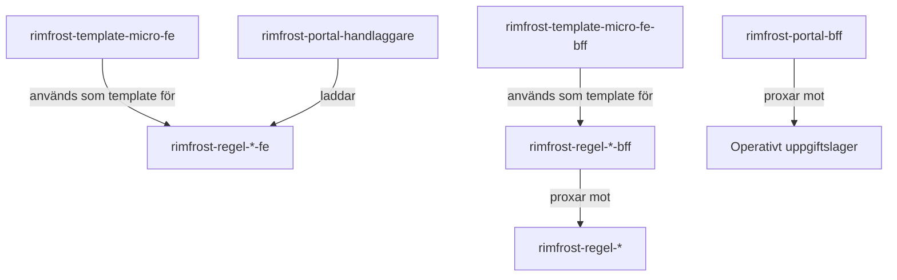

```mermaid
graph TD

    rimfrost-template-regel-manuell -->|uses| rimfrost-framework-regel-manuell
    rimfrost-template-regel-komplettering -->|uses| rimfrost-framework-regel-komplettering

    rimfrost-template-regel-maskinell -->|uses| rimfrost-framework-regel-maskinell
    rimfrost-framework-regel-maskinell -->|uses| rimfrost-framework-regel

    rimfrost-framework-regel-manuell -->|uses| rimfrost-framework-regel-oul
    rimfrost-framework-regel-komplettering -->|uses| rimfrost-framework-regel-oul
    rimfrost-framework-regel-oul -->|uses| rimfrost-framework-regel
    rimfrost-framework-regel-oul -->|uses| rimfrost-framework-oul

```

## Repositories

### rimfrost-framework-regel

Komponenter gemensamma för alla typer av regler (både maskinella och manuella).

- Inläsning av regel-konfiguration
- Kafka-interface request/response för regel initiering/avslut
- Rest-interface för hantering av Yrkande och Handläggning

### rimfrost-framework-oul

Hantering av reglers kommunikation med Operativt uppgiftslager

- Kafka-interface request/response för operativa uppgifter 
- Rest-interface hanterar Done-operation för operativa uppgifter

### rimfrost-framework-regel-oul

Bygger på `rimfrost-framework-regel` och `rimfrost-framework-oul` och ansvarar för den OUL-integration och korrelationslagring som krävs för regelkörningar som avslutas i ett separat anrop.

- Skapar och avslutar OUL-uppgifter (`createOulUppgift`, `tryEndOperativUppgift`, `endOperativUppgift`)
- Prenumererar på OUL:s statusnotifieringar via Kafka och synkroniserar till handläggningstjänsten
- Persisterar korrelationsdata (CloudEvent-attribut, `replyTo`, `ProcessTopicInfo`) per handläggning

Konsumeras av `rimfrost-framework-regel-manuell` och `rimfrost-framework-regel-komplettering`.

### rimfrost-framework-regel-komplettering

Exponerar komplettering som en Kafka-anropbar regel. Tar emot en kompletteringsförfrågan, utför en fullständighetskontroll via `isKompletteringRequired()`, och antingen skickar svar direkt (om komplettering inte behövs) eller skapar en OUL-uppgift för handläggare och inväntar kvittens. Båda vägarna resulterar i `utfall = JA`.

- Kafka request/response för kompletteringsförfrågningar med dynamisk `replyTo`-routing
- REST-gränssnitt (`GET/PATCH/POST /{handlaggningId}`) via abstrakt basklass `RegelKompletteringController<T>` för handläggarportalen
- Timeout-hantering som garanterar att svar alltid skickas

### rimfrost-framework-regel-maskinell

Komponenter gemensamma för alla maskinella regler

### rimfrost-framework-regel-manuell

Komponenter gemensamma för alla manuella regler

- Hantering av initiering av ny regel

### rimfrost-template-regel-maskinell

Template för implementation av maskinella regler.

- Template för implementation av handleRegelRequest

### rimfrost-template-regel-manuell

Template för implementation av manuella regler.

- Implementation av handleRegelrequest för alla manuella regler

### rimfrost-template-regel-komplettering

Template för implementation av kompletteringsregler.

- Template för implementation av `RegelKompletteringService` (`isKompletteringRequired`, `readSvarData`, `registerSvar`) och `RegelKompletteringController`

---

## Portal och micro-frontends

```mermaid
graph TD

    rimfrost-template-micro-fe -->|används som template för| regel-fe["rimfrost-regel-*-fe"]
    rimfrost-template-micro-fe-bff -->|används som template för| regel-bff["rimfrost-regel-*-bff"]

    rimfrost-portal-handlaggare -->|laddar| regel-fe
    rimfrost-portal-bff -->|proxar mot| OUL["Operativt uppgiftslager"]
    regel-bff -->|proxar mot| regel-backend["rimfrost-regel-*"]

```

### rimfrost-portal-handlaggare

Vue-baserad portalapplikation för handläggare. Listar tilldelade uppgifter och laddar rätt micro-frontend per uppgiftstyp baserat på uppgiftens `url`-fält från Operativt uppgiftslager.

### rimfrost-portal-bff

BFF (Backend For Frontend) för portalen. Proxar anrop mot Operativt uppgiftslager och hanterar hämtning och tilldelning av operativa uppgifter.

### rimfrost-template-micro-fe

Template för micro-frontend-implementation av manuella regler. Varje regel skapar ett eget repo baserat på denna template och implementerar en Vue-komponent som renderas inuti portalen.

### rimfrost-template-micro-fe-bff

Template för BFF till micro-frontends. Proxar anrop från micro-frontendens Vue-komponent mot regelns backend-service och hanterar eventuell datatransformation.

